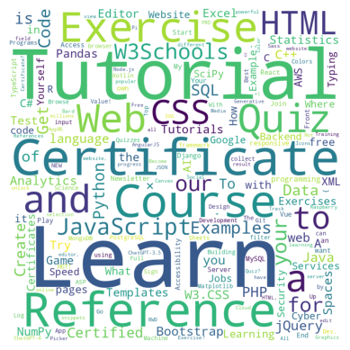

# Website Word Cloud Generator

This Python script fetches content from a website, analyzes its word frequencies, and generates a word cloud visualization.

## Usage

1. Clone the repository:
   ```bash
   https://github.com/Banula-Lavindu/NLP-WordCloud-from-websites-by-text-mining-.git
   ```
2. Navigate to the project directory:
   ```bash
   cd website-word-cloud
   ```
3. Install dependencies:
   ```bash
   pip install -r requirements.txt
   ```
4. Run the script:
   ```bash
   python generate_word_cloud.py
   ```

## Description

This script extracts text content from a specified website, tokenizes it, and calculates word frequencies. It then generates a word cloud to visualize the frequency distribution of words present in the content.

## Example

For demonstration, let's generate a word cloud for the official website of the Government of Sri Lanka (https://www.gov.lk/).
let's break down the code section by section:

### 1. Fetching Website Content
```python
import urllib.request

response = urllib.request.urlopen('https://www.gov.lk/')
html = response.read()
html_content = html.decode('utf-8')
```
- This section of the code imports the `urllib.request` module to fetch the HTML content of a website.
- It opens a connection to the website URL `'https://www.gov.lk/'` using `urllib.request.urlopen()` and reads the response into the variable `html`.
- The HTML content is decoded into a string using UTF-8 encoding and stored in the variable `html_content`.

### 2. Tokenization
```python
import re

tokens = re.split('\W+', html_content)
```
- Here, the `re` module is imported to perform regular expression operations.
- The `re.split()` function is used to tokenize the HTML content into words based on non-word characters (`'\W+'`). This splits the content into a list of tokens stored in the variable `tokens`.

### 3. Cleaning HTML Content
```python
from bs4 import BeautifulSoup

soup = BeautifulSoup(html_content, 'html.parser')
clean_text = soup.get_text()
tokens = [tok for tok in clean_text.split()]
```
- This section utilizes the BeautifulSoup library (`bs4`) to parse the HTML content and extract text.
- An instance of `BeautifulSoup` is created with the HTML content and the parser `'html.parser'`.
- The `get_text()` method extracts text from the parsed HTML content and removes any HTML tags, leaving only the clean text.
- The clean text is tokenized into words, replacing the previous token list stored in `tokens`.

### 4. Calculating Word Frequencies
```python
freq_dist = {}
for tok in tokens:
    if tok in freq_dist:
        freq_dist[tok] = freq_dist[tok] + 1
    else:
        freq_dist[tok] = 1
```
- This section calculates the frequency of each word in the tokenized content.
- A dictionary `freq_dist` is initialized to store word frequencies.
- It iterates through each token in the list `tokens` and updates the frequency count in the dictionary.

### 5. Plotting Word Frequencies
```python
import nltk

freq_dist_nltk = nltk.FreqDist(tokens)
freq_dist_nltk.plot(30, cumulative=False)
```
- Here, NLTK (Natural Language Toolkit) is used to calculate word frequencies more conveniently.
- `FreqDist` from NLTK is used to create a frequency distribution of tokens.
- The `plot()` method is called on the frequency distribution object to generate a plot of the 30 most common words, with `cumulative=False`.

### 6. Removing Stopwords
```python
from nltk.corpus import stopwords

stopword_list = set(stopwords.words('english'))
clean_tokens = [tok for tok in tokens if len(tok.lower()) > 1 and (tok.lower() not in stopword_list)]
```
- This section removes common stopwords from the tokenized content to clean the data further.
- The NLTK library's stopwords corpus is used to obtain a list of English stopwords.
- Stopwords are removed from the token list, retaining only tokens longer than one character and not in the stopword list.

### 7. Generating Word Cloud
```python
from wordcloud import WordCloud
import matplotlib.pyplot as plt

word_freq_dict = {word: freq for word, freq in freq_dist_nltk.items()}
word_cloud = WordCloud(width=800,
                       height=800,
                       background_color='white',
                       min_font_size=10)
word_cloud.generate_from_frequencies(word_freq_dict)
```
- This section imports the `WordCloud` class from the `wordcloud` library and `matplotlib.pyplot` for visualization.
- A dictionary `word_freq_dict` is created from the NLTK frequency distribution to map words to their frequencies.
- A `WordCloud` object is instantiated with custom parameters such as width, height, background color, and minimum font size.
- The `generate_from_frequencies()` method is called to generate the word cloud based on the word-frequency dictionary.

### 8. Displaying Word Cloud
```python
plt.figure()
plt.imshow(word_cloud)
plt.axis('off')
plt.show()
```
- Finally, this section displays the generated word cloud using Matplotlib.
- A new figure is created, and the word cloud image is shown using `imshow()`.
- Axis is turned off (`plt.axis('off')`) to remove axis labels.
- The word cloud is displayed using `plt.show()`.

- 



This concludes the explanation of the code section by section. Each part contributes to the process of fetching website content, analyzing word frequencies, and visualizing them in the form of a word cloud.
## Dependencies

- Python 3.x
- BeautifulSoup
- NLTK
- Matplotlib
- WordCloud

## License

This project is licensed under the MIT License - see the [LICENSE](LICENSE) file for details.

